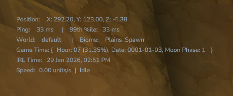
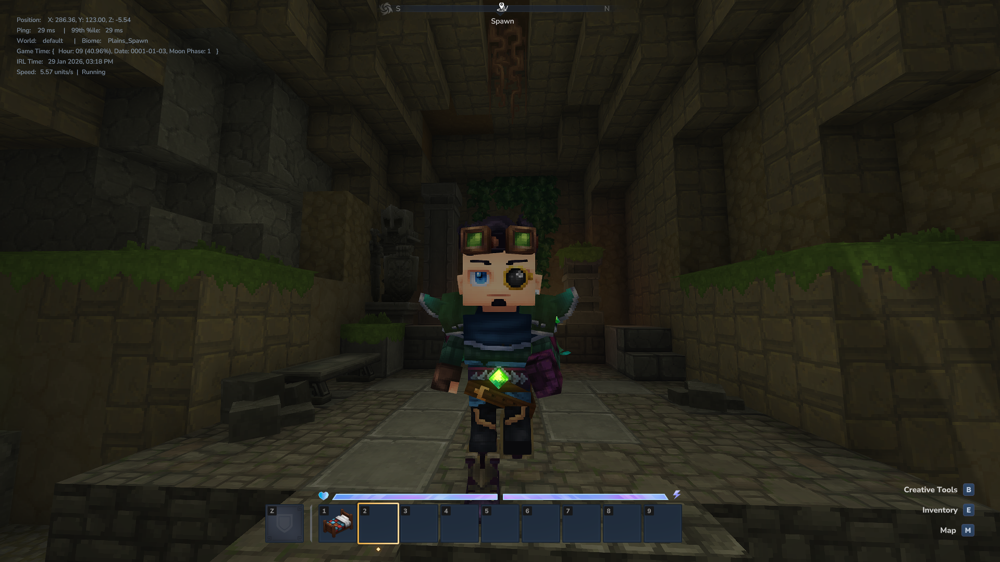
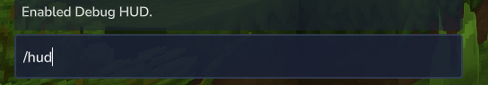

# DebugHud Plugin for Hytale

A Debug hud with lots of player and world information thats usually needed by players.
 
<b>Note:</b> command can be used by anyone, and is not restricted by OP, or configuration changes for the commands to be run by anyone. 

### Commands
• <b>/hud: </b> Command to Enable/ Disable the Debug hud
 

### Current Information
• Player Position
 
• Player Ping
 
• World and Biome Name
 
• Game Time and IRL Time
 
• Player Speed and movement state
 

### Screenshots

  

  

  

### Working On
• Working on adding more information to the hud
 
• Working on adding a configuration command to enable disable each debug row
 
• Working on adding configuration to change the debug hud position relatively (like topleft, topright, bottomleft, etc)
 

(The template used for Starting Hytale java plugins development was created by [Up](https://github.com/UpcraftLP), and slightly modified by Kaupenjoe.)
